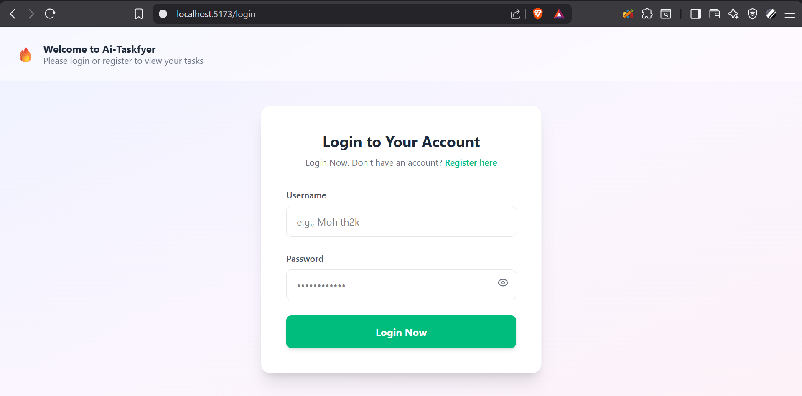
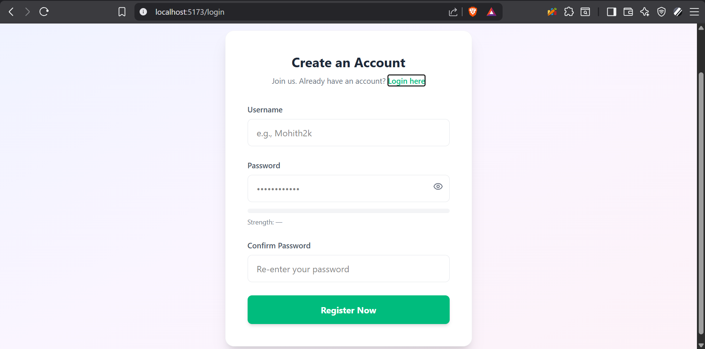
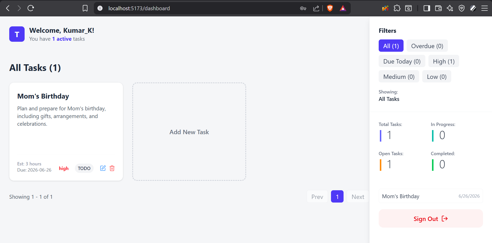

# Taskfyer - Frontend Client

Taskfyer is a modern, responsive Single Page Application (SPA) designed to make task management effortless. It features a clean, intuitive UI built with React and Tailwind CSS, secure JWT-based routing, and a seamless integration with an AI assistant to automate task creation.

## 📸 Screenshots

### Authentication (Login & Register)

*Clean, modern login interface with password visibility toggle.*


*Seamless registration flow with password strength indicators.*

### Main Dashboard

*The central hub displaying a responsive grid of colored-coded tasks, priority tags, and an active analytics sidebar.*

*(Note: AI Task Generation modal screenshot coming soon!)*

## 🚀 Tech Stack Used

* **React.js** (Core UI library)
* **Vite** (Next-generation frontend tooling for blazing-fast HMR and builds)
* **Tailwind CSS v4** (Utility-first CSS framework for rapid UI styling)
* **React Router DOM** (Client-side routing and protected route management)
* **Lucide React** (Modern, lightweight iconography)
* **Context API** (Global state management for tasks and UI modals)

## 🏗️ Architecture Overview

The frontend is structured to strictly separate presentation from business logic:
1. **Routing Layer (`App.jsx`):** Manages navigation between public and private routes. The `ProtectedRoute` component intercepts navigation, checking the browser's `localStorage` for a valid JWT token before allowing access to the dashboard.
2. **State Management (`TaskContext.jsx`):** Acts as the single source of truth. It handles all asynchronous `fetch` calls to the Spring Boot backend, manages the global list of tasks, and controls the visibility of the task creation modal.
3. **Component UI Layer:** Reusable components (`Sidebar`, `Header`, `TaskGrid`, `TaskModal`) consume the global context to render data dynamically and trigger state changes without complex prop-drilling.

## 🤖 AI Integration (Frontend Flow)

Taskfyer provides a magical user experience for task creation by leaning on a backend-connected GitHub AI model. 

Inside the `TaskModal` component, users can type a brief task title and click the **✨ AI** button. The frontend then:
1. Disables the form and displays a loading state.
2. Sends an authenticated `GET` request to the backend's `/api/tasks/aiDesc` endpoint with the URL-encoded title.
3. Receives a structured JSON payload containing a detailed description, priority, and estimated time.
4. Instantly updates the React component state, auto-filling the form fields for the user to review before saving.

## 🛠️ Setup Instructions

### Prerequisites
* **Node.js** (v18 or higher recommended)
* **npm** (Node Package Manager)
* Ensure the **Taskfyer Spring Boot Backend** is running locally on port `8080`.

### Installation & Execution
1. Clone the repository and navigate to the `frontend` directory.
2. Install all necessary dependencies:
   ```bash
   npm install